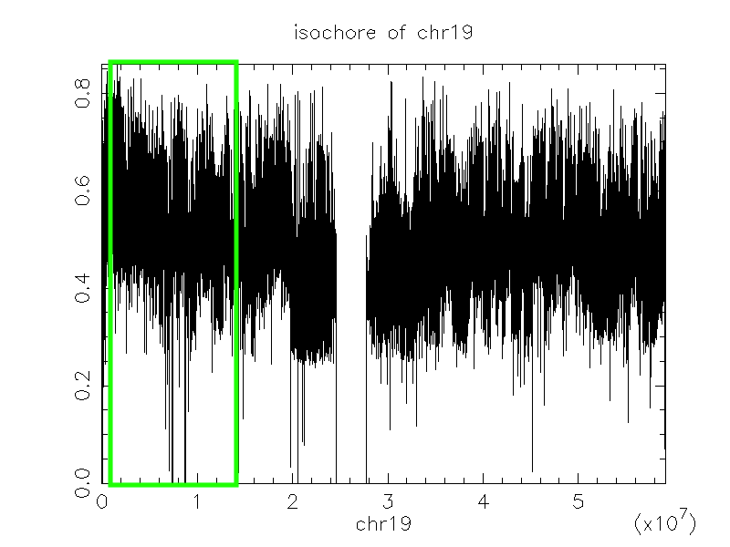
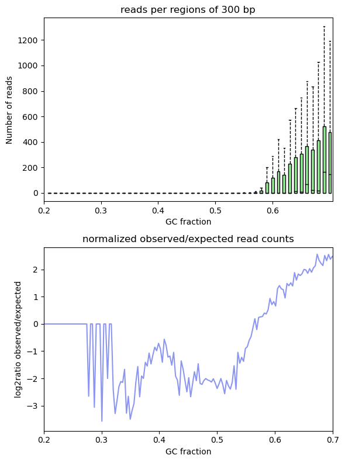

The assignment was composed of three main parts: __read coverage, variant calling and analytical performance__. For each part, I report the questions that were asked, the strategy that I have used to answer them and the results that were generated. 

## (1) Read coverage

In Next Generation Sequencing (NGS) studies, the term “coverage” describes a relation between sequence reads and a reference. A reference can be a whole genome, a specific chromosome or targeted genomic regions.  
The first question of the assignment was:  
__What can you say about the quality of the read coverage in the sample?__

First, to reduce biased coverage estimates, I have identifyed and removed read pairs that were likely to have originated from duplicates of the same original DNA fragments through some artifactual processes during sample preparation (e.g., library construction using PCR). For the given sample, ~25% of the aligned reads were estimated to be duplicates and were removed. The data should also be corrected for patterns of systematic errors in the base quality scores which are confidence scores emitted by the sequencer for each base. Base quality scores play an important role in weighing the evidence for or against possible variant alleles during the variant discovery process, so it's important to correct any systematic bias observed in the data. However, because in part 3 of the assignment it was asked to compare between variant calls (i.e., ground truth vs. variants called by the pipeline), I have performed the base quality recalibration step at a later stage of the pipeline. I have integreated the statistics of analytical performance (sensitivity, precision and specificity) with information from the recalibration step in order to propose an additional reason for the difference between variant calls.  
After filtering out duplicated reads, I have calculated read coverage within a region of chromosome 19 of the human genome hg19 which was where the assigned DNA sequences were aligned to. This genomic interval of chr19 started at position 60,004 and ended at position 14,992,498, for a total length of 14,932,495 bases. This information was retrieved from the BAM file without duplicates via:

```{bash interval_chr19, eval=FALSE}
samtools view ../Files_needed_for_task/chr19_dedup_sort.bam | awk '{print $3 "\t" $4 "\t" $4+length($10)-1}' > results/1_read_coverage/chr19_interval.txt
sort -nk2 results/1_read_coverage/chr19_interval.txt | awk 'NR==1{print "min:"$2} END{print "max:"$3}'
```

The percetage of the chr19 interval that was covered by at least one read can be calculated as:

$\left ( \frac{\text{No. of bases covered}}{\text{chr19 interval}} \right) \times 100$

After calculating the number of bases with zero read coverage (11,464,884 bases; see code below), it is possible to obtain the number of bases covered by at least one read $(14,932,495 - 11,464,884 = 3,467,611)$ and so the percentage of 1X covarage $(3,467,611/14,932,495) \times 100 = 23\%$. Thus, the selected interval of chr19 was overall poorly covered and on average, there were 14 reads per base pair meaning an average 14X coverage (Fig. 1). For single sample sequencing, which is the case of this assignment, an average 30X coverage has been a standard minimum for generating a reliable variant call and more recently this mininum has been raised to 50X or 100X coverage, especially in studies on cancer __(REF)__. Given that, in this assignemnt, the overall fraction of the chr19 region was scarcely covered and that the average coverage was much lower than the current standards, the variant calling output for the given sample should be treated with caution. I expect the variant calling output to contain variants that are not present in the ground truth (false positives) as well as to lack variants that are instead present in the groun truth. Hence, I expect this pipeline to be less sensitive, less precise and less specific at calling variants than the pipeline used for generating the ground truth.


```{bash depth}
samtools depth ../Files_needed_for_task/chr19_dedup_sort.bam > results/1_read_coverage/chr19_depth.txt

# The first line of the file chr19_cov_redundancy.txt is the number of bases with zero read coverage
cut -f 3 results/1_read_coverage/chr19_depth.txt | sort | uniq -c > results/1_read_coverage/chr19_cov_redundancy.txt

# Mean coverage
awk '{ sum += $3 } END { if (NR > 0) print sum / NR }' results/1_read_coverage/chr19_depth.txt
```

The count of the number of overlapping reads tells us how many bases are covered how many times.

```{bash plot_cov}
plotCoverage -b 
```


```{r cov_variation, eval=FALSE}
# READ DEPTH DATA GENERATED BY SAMTOOLS DEPTH
dep <- read.table(file = "results/1_read_coverage/chr19_depth.txt")
colnames(dep) <- c("CHROM", "POS", "DEPTH")

```

{ width=35% } { width=35% } 


## (2) Variant calling

SNPs as presented in public databases like dbSNP (32,33) or HapMap (34) are germline variations for which at most population frequencies are known. In literature it is usually assumed that the variation should be found in more than 1% of the population in order to be called a SNP. Such information is very useful for biomarker development since it describes the prevalence of the mutation in different populations. However, it is normally not possible to get additional information (like gender, age, or disease status) on the individuals having the SNP, only the population a person belongs to is given. Since it is not known if the information comes from a tumor or normal sample, a correlation between diseases and SNPs cannot be calculated.


## (3) Analytical performance

