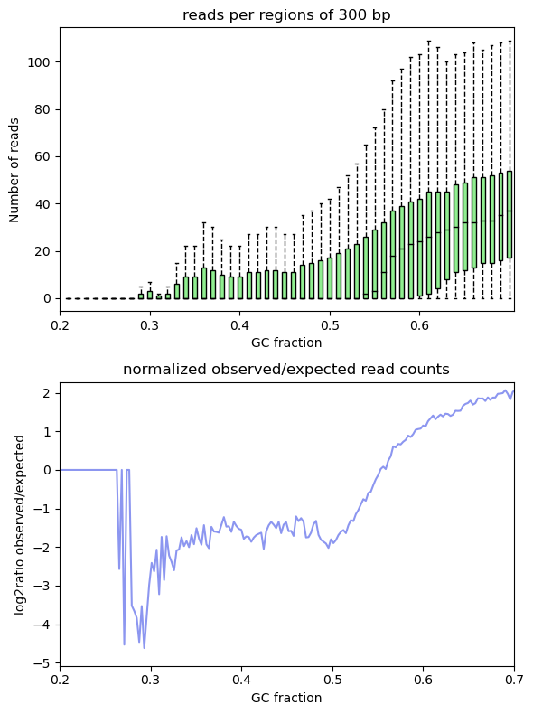
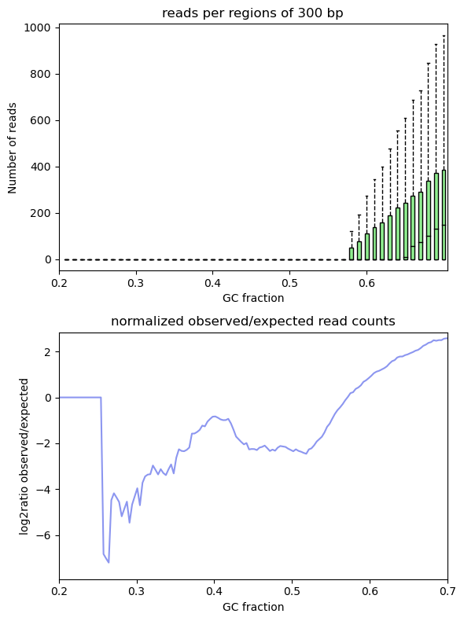

The assignment for the Bioinformatician (Pipeline Development) position at SOPHiA GENETICS was composed of three main parts: __read coverage, variant calling and analytical performance__. The assignment was based on a targeted capture sequencing experiment in which paired-end reads were generated for one sample at a selected region of chromosome 19 of the human genome hg19.  
In this report, I first provide a brief background about capture sequencing technology with respect to the analysis of human genetic disorders, I then describe a bioinformatics workflow that I have implemented specific for this assignment and finally, I lay out the results that were generated in combination with my interpretation. The pipeline and the scripts have been uploaded to GitHub at this [link](https://github.com/sam0per/Bioinformatics_pipeline_development_task){target="_blank"}

# Background

Protein coding genes constitute only approximately 1% of the human genome but harbor 85% of the

Genetic mutations in protein coding genes are very likely to disrupt important biological functions and studying how these mutations appear and evolve is key for understanding disease-related traits in humans. Efficient strategies have been developed for selectively sequencing complete coding regions (i.e., ‘‘whole exome’’) and analysing thousands of genes simultaneously using next-generation sequencing techniques. For einstance, by sequencing the exome of a patient and comparing it with a normal reference sequence, variations in an individual’s DNA sequence can be identified and related back to the individual’s medical concerns in an effort to discover the cause of the medical disorder [@VanDijk2014].  
Early comparative studies have focused on comparison of target intervals of various exome kits, and identified several important biases inherent to WES technology, such as coverage biases in regions with very high or low GC content9,10,11 [@barbitoff2020]

In Next Generation Sequencing (NGS) studies, the term “coverage” describes the number of times that a nucleotide or base in the reference is covered by a high-quality aligned read. A reference can be a whole genome, a specific chromosome or targeted genomic regions and the number of reads that align to, or "cover" it is known as redundancy of coverage and also as the depth or the depth of coverage [@sims2014]. Coverage has also been used to denote the breadth of coverage of a target genome, which is defined as the percentage of target bases that are sequenced a given number of times. For example, a genome sequencing study may sequence a genome to 30X average depth and achieve a 95% breadth of coverage of the reference genome at a minimum depth of ten reads.  

Whole genome sequencing (WGS) and Whole exome sequencing (WES) methods are applied in clinical settings for detecting patient’s genomic variants and etiology of the disease. Whole exome sequencing (WES), is becoming a standard, more economic approach to genome sequencing [1]. Although it covers only exonic regions (< 2% of the whole genome), it produces a large quantity of data (raw reads) that requires a significant amount of bioinformatics analysis to create biologically meaningful information [2]. [@kumaran2019]

Next-generation sequencing (NGS) is rapidly becoming an invaluable tool in human genetics research and clinical diagnostics1,2,3. Practical use of NGS methods has dramatically increased with the development of targeted sequencing approaches, such as whole-exome sequencing (WES) or targeted sequencing of gene panels. WES emerged as an efficient alternative to whole-genome sequencing (WGS) due to both lower sequencing cost and simplification of variant analysis and data storage4. More than 80% of all variants reported in ClinVar, and more than 89% of variants reported to be pathogenic, come from the protein-coding part of the genome; this number increases to 99% when immediate CDS vicinity is included. Even allowing for the sampling bias, there is an overall agreement that most heritable diseases appear to be caused by alterations in the protein-coding regions of the genome. Given this, WES has dominated the projects characterizing human genome variation as well as clinical applications. [@barbitoff2020]

Early comparative studies have focused on comparison of target intervals of various exome kits, and identified several important biases inherent to WES technology, such as coverage biases in regions with very high or low GC content9,10,11 [@barbitoff2020]

# Methods

For this assignment, I was provided with three files: a BAM file containig paired reads that were aligned to a portion of chromosome 19 of the human genome hg19 using Bowtie 2, a BED file for the genomic regions of interest and a single-sample VCF file with a list of known single nucleotide variants (SNVs), and insertions and deletions (INDELs). The aim was to develop a bioinformatics pipeline 

Duplicate reads ... Unique reads were retained and they were all aligned and paired properly.

# Results and Discussion

### (1) Read coverage

In Next Generation Sequencing (NGS) studies, the term “coverage” describes the number of times that a nucleotide or base in the reference is covered by a high-quality aligned read. A reference can be a whole genome, a specific chromosome or targeted genomic regions and the number of reads that align to, or "cover" it is known as redundancy of coverage and also as the depth or the depth of coverage [@sims2014]. Coverage has also been used to denote the breadth of coverage of a target genome, which is defined as the percentage of target bases that are sequenced a given number of times. For example, a genome sequencing study may sequence a genome to 30X average depth and achieve a 95% breadth of coverage of the reference genome at a minimum depth of ten reads.  
In this assignment, the reference was a region of chromosome 19 of the human genome hg19 and the first question was:  
__What can you say about the quality of the read coverage in the sample?__

First, to reduce biased coverage estimates, I have identified and removed read pairs that were likely to have originated from duplicates of the same original DNA fragments through some artifactual processes during sample preparation (e.g., library construction using PCR). For the given sample, ~25% of the aligned reads were estimated to be duplicates and were removed using Picard MarkDuplicates [@picard2018toolkit]. The removal of duplicate reads is expected to reduce non-uniformity of coverage and thus, increase the power to detect variants [@kozarewa2009]. The data should also be corrected for patterns of systematic errors in the base quality scores which are confidence scores emitted by the sequencer for each base. Base quality scores play an important role in weighing the evidence for or against possible variant alleles during the variant discovery process, so it's important to correct any systematic bias observed in the data. However, because in part 3 of the assignment it was asked to compare between variant calls (i.e., ground truth vs. variants called by the pipeline), I have performed the base quality recalibration step at a later stage of the analysis. I have integrated the statistics of analytical performance (sensitivity, precision and specificity) with information from the recalibration step in order to give an additional view on potential reasons for the difference between the two variant calls.  
After filtering out duplicate reads, I have calculated both the redundancy and breadth of coverage for  high-quality bases ($\geq$Q20) from high-quality alignments ($\geq$MapQ30), within the region of chromosome 19 of the human genome hg19 using SAMtools [@li2009] and deepTools [@ramirez2016deeptools2].

The breadth of coverage or the percentage of the chr19 genomic region that was covered by, for example, a minimum of ten reads was 15%. Thus, the selected interval of chr19 was overall poorly covered (low breadth of coverage) and on average, there were 13 reads per base pair, meaning an average of 13X coverage (Fig. 1 top panel). Even after the removal of duplicate reads, the overall coverage was still non-uniform suggesting that this portion of chr19 is prone to coverage fluctuations due to biases connected with sample preparation, sequencing, genomic alignment and/or assembly.

For single sample sequencing, which is the case of this assignment, an average of 30-35X coverage has been the standard minimum for generating a reliable variant call [@ajay2011; @sims2014]. Given that the overall fraction of the chr19 region was scarcely covered and that the average coverage was much lower than the current standard, the variant calling output for the given sample should be treated with caution. I expect the variant calling output to contain variants that are not present in the ground truth (false positives) as well as to lack variants that are instead present in the ground truth (false negatives). I expect, of course, to find true positives and true negatives using this pipeline but it will be less sensitive, less precise and less specific at calling variants than the pipeline used for generating the ground truth.

{ width=65% }

\  

One important point must be made and that is about the statistic that it is often used for predicting the quality of the variant calling analysis. The mean of a continuous variable is mostly meaningful when the values are normally distributed and the variance is homogeneous. In NGS studies where [e.g., @prabhu2009; @yoon2009] coverage follows a normal distribution and it is homoscedastic, the mean is then a valid proxy for depth of coverage and thus, for predictive the overall power of variant calling. The same criterion applies in studies where coverage is high and uniform across the sequence of reference
However, coverage data is rarely normally distributed nor homoscedastic suggesting that the mean is not a very appropriate proxy for depth of coverage and thus, may neither be strongly predictive for the reliability of the variant calling output.

The count of the number of overlapping reads tells us how many bases are covered how many times.

it was due to the fact that many of my target regions exhibited high sequence similarity to other regions of the genome. Thus, reads that should have gone to my target regions were being 'robbed' by other regions of similar sequence. This, coupled with other target regions that had relatively 'unique' sequence, results in a distorted coverage profile much more exaggerated than the profile you've posted. It isn't necessarily a problem and I would say that your data is fine. However, set a high mapping quality in order to ensure that your reads have high probability of mapping to the regions that you expect the to.

\  

{ width=35% } { width=35% } 

\  

The transition/transversion ratio (Ti/Tv ratio) is the proportion of the variants observed as transitions (between purines, or between pyrimidines) versus transversions (between purines and pyrimidines). The Ti/Tv ratio is particularly useful for assessing the quality of single nucleotide polymorphisms inferred from sequencing data [31, 32]. A higher ratio generally indicates higher accuracy [27] [@jiang2019].

### (2) Variant calling

SNPs as presented in public databases like dbSNP (32,33) or HapMap (34) are germline variations for which at most population frequencies are known. In literature it is usually assumed that the variation should be found in more than 1% of the population in order to be called a SNP. Such information is very useful for biomarker development since it describes the prevalence of the mutation in different populations. However, it is normally not possible to get additional information (like gender, age, or disease status) on the individuals having the SNP, only the population a person belongs to is given. Since it is not known if the information comes from a tumor or normal sample, a correlation between diseases and SNPs cannot be calculated.

### (3) Analytical performance

# References