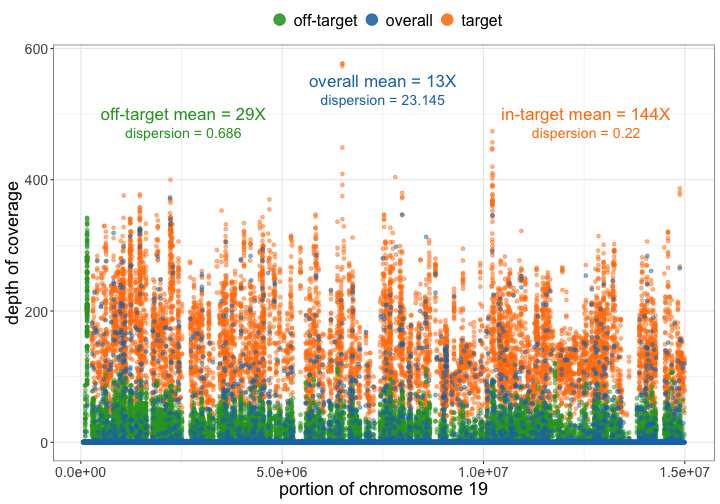

The assignment for the Bioinformatician (Pipeline Development) position at SOPHiA GENETICS was composed of three main parts: __read coverage, variant calling and analytical performance__. The assignment was based on a targeted capture sequencing experiment in which paired-end reads were generated for one sample at a selected region of chromosome 19 of the human genome hg19.  
In this report, I first provide a brief background about capture sequencing technology with respect to the analysis of human genetic disorders. Then, for each of the three parts, I describe and interpret the respective results that were generated using a bioinformatics workflow for the analysis of clinical genomics (Fig. 1). The pipeline and the scripts have been uploaded to GitHub at this [link](https://github.com/sam0per/Bioinformatics_pipeline_development_task){target="_blank"}. The instructions on how to set it up and run it are provided at the same link.

### Background

Genetic mutations in protein coding genes are very likely to disrupt important biological functions and studying how these mutations appear and evolve is key for understanding disease-related traits in humans. Efficient strategies have been developed for selectively sequencing complete coding regions (i.e., ‘‘whole exome’’) and analysing thousands of genes simultaneously using next-generation sequencing techniques [@VanDijk2014]. For instance, by sequencing the exome of a patient and comparing it with a normal reference sequence, variations in an individual’s DNA sequence can be identified and related back to the individual’s medical concerns in an effort to discover the cause of the medical disorder.  
Early comparative studies have focused on comparison of target intervals of various exome kits, and identified several important biases inherent to whole exome sequencing technology, such as coverage biases in regions with very high or low GC content [@barbitoff2020]. One such region is the human chromosome 19 which includes gene density more than double the genome-wide average and 20 large tandemly clustered gene families. It also has the highest GC content of any chromosome, especially outside gene clusters [@Grimwood2004]. Genomic regions like chr19 have been shown to be highly variable within humans, providing an excellent resource for the identification of the genetic basis of common and rare diseases. 
In Next Generation Sequencing (NGS) studies, the term “coverage” describes the number of times that a nucleotide or base in the reference is covered by a high-quality aligned read. A reference can be a whole genome, a specific chromosome or targeted genomic regions and the number of reads that align to, or "cover" it is known as redundancy of coverage and also as the depth or the depth of coverage [@sims2014]. Coverage has also been used to denote the breadth of coverage of a target genome, which is defined as the percentage of target bases that are sequenced a given number of times. For example, a genome sequencing study may sequence a genome to 30X average depth and achieve a 95% breadth of coverage of the reference genome at a minimum depth of ten reads.  
For this assignment, I was provided with three files: a BAM file containig paired reads that were aligned to a portion of chromosome 19 of the human genome hg19 using Bowtie 2, a BED file for the genomic regions of interest and a single-sample VCF file with a list of known single nucleotide variants (SNVs), and insertions and deletions (INDELs). The aim was to develop a bioinformatics pipeline starting from these three files and eventually analysing read coverage, calling variants and comparing the quality of the calls between ground truth and the pipeline (Fig .1).  


### (1) Read coverage

First, to reduce biased coverage estimates, I have identified and removed read pairs that were likely to have originated from duplicates of the same original DNA fragments through some artifactual processes during sample preparation (e.g., library construction using PCR). For the given sample, ~25% of the aligned reads were estimated to be duplicates and were removed using Picard MarkDuplicates [@picard2018toolkit] (see also the other HTML file with interactive figures). The removal of duplicate reads is expected to reduce non-uniformity of coverage and thus, increase the power to detect variants [@kozarewa2009].  
After filtering out duplicate reads, I have calculated both the redundancy and breadth of coverage for high-quality bases ($\geq$Q20) from high-quality alignments ($\geq$MapQ30), within the region of chromosome 19 of the human genome hg19 using SAMtools [@li2009] and deepTools [@ramirez2016deeptools2]. I have fitted a negative binomial model to the per-base depth data using R [@rstudio] in order to assess the uniformity of the coverage distribution. Genomic coverage is expected to follow a Poisson distribution [@Lander1988] but factors such as sample handling, library preparation and gene content may introduce biases in sequencing that may affect its uniformity across a reference sequence. When the coverage is unevenly distributed, dispersion of the data is increased and this variation might be more accurately 

Then, I have restricted the coverage analysis to the target and off-target regions.  
On average, each base of the chr19 region was covered by 13 reads, meaning an average of 13X coverage (Fig. 2). The overal coverage was non-uniform (dispersion = 23) even after the removal of duplicate reads which was expected given the specific chatacteristics in GC content and gene dnsity of chr19 which are likely involved in coverage fluctuations due to biases connected with sample preparation, sequencing, genomic alignment and/or assembly.  
For single sample sequencing, which is the case of this assignment, an average of 30-35X coverage has been the standard minimum for generating a reliable variant call [@ajay2011; @sims2014]. 

99% at 30X
Because the overall mean of coverage at the portion of chr19 was lower than the current standard, I expected for the output of the variant calling to contain variants that are not present in the ground truth (false positives) as well as to lack variants that are instead present in the ground truth (false negatives). As a consequence, I expected to recall known variants with less sensitivity and less precision. In terms of 

{ width=65% }

\  

Ideally, a sample should show a uniform distribution of sequenced reads across the genome, i.e. all regions of the genome should have similar numbers of reads, regardless of their base-pair composition. In reality, the DNA polymerases used for PCR-based amplifications during the library preparation of the sequencing protocols prefer GC-rich regions. This will influence the outcome of the sequencing as there will be more reads for GC-rich regions just because of the DNA polymerase’s preference [@Benjamini2012].  
Using the software deepTools, the expected GC profile was calculated by counting the number of DNA fragments of a fixed size per GC fraction where GC fraction is defined as the number of G’s or C’s in a genome region of a given length. I have used as length the number of bases that were reported in the target region file (BED file). The result is basically a histogram depicting the frequency of DNA fragments or reads for each type of genome region with a GC fraction between 0 to 100 percent. The profile of the expected DNA fragment distribution is then compared to the observed GC profile, which is generated by counting the number of sequenced reads per GC fraction.

As you can see, both plots based on simulated reads do not show enrichments or depletions for specific GC content bins, there is an almost flat line around the log2ratio of 0 (= ratio(observed/expected) of 1).

{ width=35% } { width=35% } 

Figure 3. Off-target (left) and on-target (right) GC content using deepTools. Top: Boxplot depicting the observed number of reads for each type of genome region with a GC fraction between 0 to 100 percent. Bottom: log2ratio of the ratio between observed and expected number of reads with a given fraction of G’s or C’s bases.

\  

### (2) Variant calling

GC correction

Given the on-target mean coverage (144X), I have assumed that the original sequencing depth of the experiment was not aimed at detecting somatic mutations as it is often recommended to reach at least 250X to be able to find rare genetic changes. I have also performed a comparison with the variants collected in the COSMIC database and obtained very few matches (results not shown here). Hence, my decision to adopt an approach based on a germline variant calling using two of the most well-known softwares: GATK [@McKenna2010] and SAMtools [@li2009]. Default options were used for the calling and the same set of filters were then applied to both datasets.  
In literature it is usually assumed that the variation should be found in more than 1% of the population in order to be called a variant Such information is very useful for biomarker development since it describes the prevalence of the mutation in different populations.

The variant callers provide a quality score (the QUAL) column, which gives an estimate of how likely it is to observe a call purely by chance. An easy way to filter low quality calls is


### (3) Analytical performance

Variants called by the pipeline were matched to the ground truth by genomic position

GATK consistently performed well for InDel detection

However, the false discovery rate (FDR) is much lesser in simulated than real data, which could be due to the underlying error model of experimental exome sequencing.

```{r, echo=FALSE, message=FALSE}
dt <- read.table("results/3_performance/chr19_gatk.scores.tsv", header = TRUE)
knitr::kable(dt, caption = "Table 1. Analytical performance of GATK.")

ds <- read.table("results/3_performance/chr19_samtools.scores.tsv", header = TRUE)
knitr::kable(ds, caption = "Table 2. Analytical performance of SAMtools.")

```

\  

The transition/transversion ratio (Ti/Tv ratio) is the proportion of the variants observed as transitions (between purines, or between pyrimidines) versus transversions (between purines and pyrimidines). The Ti/Tv ratio is particularly useful for assessing the quality of single nucleotide polymorphisms inferred from sequencing data [31, 32]. A higher ratio generally indicates higher accuracy [27] [@jiang2019].  
We calculated the ratio of transition (Ti) to transversion (Tv), one of the key quality metrics in detecting SNVs. The Ti/Tv ratio was ~ 3.4 on exome-1 and exome-2, and ~ 3.2 on exome-3 and exome-4

we report GRCh38 is preferred genome for evaluation studies. Moreover, it is reported to offer high coverage, more accurate genomic analysis and improved annotation of the centromere regions [@Guo2017; @kumaran2019]

# References