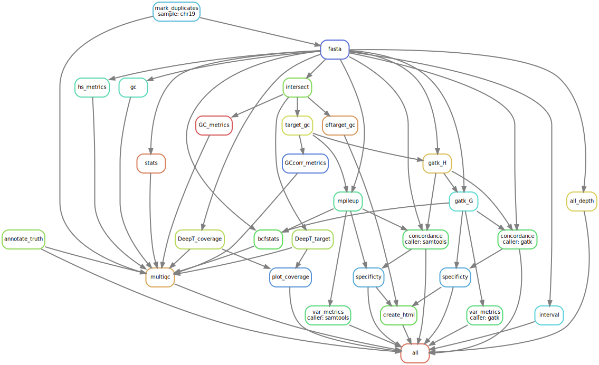

The assignment for the Bioinformatician (Pipeline Development) position at SOPHiA GENETICS was composed of three main parts: __read coverage, variant calling and analytical performance__. The assignment was based on a targeted capture sequencing experiment in which paired-end reads were generated for one sample at a selected region of chromosome 19 of the human genome hg19.  
In this report, I first provide a brief background about capture sequencing technology with respect to the analysis of human genetic disorders. Then, for each of the three parts, I describe and interpret the respective results that were generated using a bioinformatics workflow for the analysis of clinical genomics (Fig. 1). The pipeline and the scripts have been uploaded to GitHub at this [link](https://github.com/sam0per/Bioinformatics_pipeline_development_task){target="_blank"}. The instructions on how to set it up and run it are also provided at the same link.

### Background

Genetic mutations in protein coding genes are very likely to disrupt important biological functions and studying how these mutations appear and evolve is key for understanding disease-related traits in humans. Efficient strategies have been developed for selectively sequencing complete coding regions (i.e., 'whole exome') and analyzing thousands of genes simultaneously using Next-Generation Sequencing (NGS) techniques [@VanDijk2014]. For instance, by sequencing the exome of a patient and comparing it with a normal reference sequence, variations in an individual’s DNA sequence can be identified and related back to the individual’s medical concerns in an effort to discover the cause of the medical disorder.  
In studies where comparisons of target intervals of various exome kits have been performed, several important biases inherent to whole exome sequencing technology have been identified, such as coverage biases in regions with very high or low GC content [@Wang2017; @Meienberg2015]. One such region is the human chromosome 19 which has the highest GC content of any chromosome, especially at the p arm and it also includes gene density more than double the genome-wide average [@Grimwood2004]. Genomic regions like chr19 have been shown to be highly variable within humans, providing an excellent source of genetic variation that can be used for identifying the genetic basis of common and rare diseases. However, it remains still unclear how to deal with coverage biases even though great progress has been made in terms of sequencing chemistry and statistical analysis [@barbitoff2020; @1000gen; @Bainbridge2010].  
In NGS studies, the term “coverage” describes the number of times that a nucleotide or base in the reference is covered by a high-quality aligned read. A reference can be a whole genome, a specific chromosome or targeted genomic regions and the number of reads that align to, or "cover" it is known as redundancy of coverage; other terms are depth or depth of coverage [@sims2014]. Coverage has also been used to denote the breadth of coverage of a target genome, which is defined as the percentage of target bases that are sequenced a given number of times. For example, a genome sequencing study may sequence a genome to 30X average depth and achieve a 95% breadth of coverage of the reference genome at a minimum depth of ten reads.  
For this assignment, I was provided with three files: a BAM file containing paired reads that were aligned to a portion of chromosome 19 of the human genome hg19 using Bowtie2 [@Langmead2012], a BED file for the genomic regions of interest and a single-sample VCF file with a list of known single nucleotide variants (SNVs), and insertions and deletions (INDELs). The aim was to develop a bioinformatics pipeline starting from these three files and ending with an analysis of read coverage and a test for performance of the pipeline variant calling in comparison to the true list of variants (Fig .1).  



### (1) Read coverage

In order to reduce biases introduced by coverage distribution, I have identified and removed read pairs that were likely to have originated from duplicates of the same original DNA fragments through some artifactual processes during sample preparation (e.g., library construction using PCR). For the given sample, ~25% of the aligned reads were estimated to be duplicates and were removed using Picard MarkDuplicates [@picard2018toolkit] (see also the MultiQC HTML, section Picard MarkDuplicates). The removal of duplicate reads is expected to reduce non-uniformity of coverage and thus, increase the power to detect variants [@kozarewa2009].  
After filtering out duplicate reads, I have calculated both the redundancy and breadth of coverage for high-quality bases ($\geq$Q20) from high-quality alignments ($\geq$MapQ30), within the region of chromosome 19 of the human genome hg19 using SAMtools [@li2009] and deepTools [@ramirez2016deeptools2]. I have fitted a negative binomial model to the per-base depth data using R [@rstudio] in order to assess the uniformity of the coverage distribution. Genomic coverage is expected to follow a Poisson distribution [@Lander1988] but factors such as sample handling, library preparation and gene content may introduce biases in sequencing that may affect its uniformity across a reference sequence. When the coverage is unevenly distributed, dispersion of the data is increased and this variation might be better described by a function that accounts for over-dispersion, such as a negative binomial function. The same type of analysis was also performed for the target and off-target regions of chr19.  
On average, each base of the chr19 region was covered by 13 reads, meaning an overall average of 13X coverage (Fig. 2). However, the overall coverage was clearly non-uniform (dispersion = 23), even after the removal of duplicate reads. A result that was expected given the specific characteristics in GC content and gene density of chr19.  
For single sample sequencing, which is the case of this assignment, an average of 30-35X coverage has been the standard minimum for generating a reliable variant call [@ajay2011; @sims2014] and after restricting the coverage analysis within the target regions, 99% of the bases were covered by a minimum of 30 reads (see MultiQC HTML) with a distribution that was much more even than that of the whole portion of chr19 (dispersion = 0.22; Fig. 2). There was a ten-fold difference in mean coverage between targeted regions and the overall interval of chr19 and a five-fold difference between on- and off-target regions (Fig. 2).

\  

{ width=65% }

\  

Ideally, a sample should show a uniform distribution of sequenced reads across the genome, i.e. all regions of the genome should have similar numbers of reads, regardless of their base-pair composition. In reality, the DNA polymerases used for PCR-based amplifications during the library preparation of the sequencing protocols prefer GC-rich regions. This will influence the outcome of the sequencing as there will be more reads for GC-rich regions just because of the DNA polymerase’s preference [@Benjamini2012].  
Using the software deepTools, the expected GC profile was calculated by counting the number of DNA fragments of a fixed size per GC fraction where GC fraction is defined as the number of G’s or C’s in a genome region of a given length. I have used as length the number of bases that were reported in the target region file (BED file). The profile of the expected DNA fragment distribution is then compared to the observed GC profile, which is generated by counting the number of sequenced reads per GC fraction.
The targeted regions showed a strong deviation in GC content and the excess was more evident than in the off-target regions (Fig. 3). This excess is likely due to a high targeted number of exons that is well-known to be positively correlated with GC content [@Grimwood2004]. To confirm that the target regions were mostly represented by exons, I have annotated using SnpEff [@Cingolani2012] the ground truth call-set and found that more than 60% of the variants were predicted to have occurred in protein-coding sequences (MultiQC HTML, section SnpEff).

\  

{ width=35% } { width=35% } 

Figure 3. Off-target (left) and on-target (right) GC content using deepTools. Top: Box-plot depicting the observed number of reads for each type of genomic region with a GC fraction between 0 to 70 percent. Bottom: log2ratio of the ratio between observed and expected number of reads with a given fraction of G’s or C’s bases. Under an ideal scenario the blue line will be flat around zero indicating no enrichments or depletions of GC content bins.

\  

### (2) Variant calling

Variant calling was performed on GC corrected paired reads that uniquely mapped to the target regions (see MultiQC HTML, section Picard and SAMtools). Given the on-target mean coverage (144X), I have assumed that the original sequencing depth of the experiment was not aimed at detecting somatic mutations as it is often recommended to reach a minimum of 200X to be able to find rare genetic changes. I have also performed a comparison with the variants collected in the COSMIC somatic database and obtained a few matches (results not shown here). Hence, my decision to adopt an approach based on a germline variant calling using two software: GATK HaplotypeCaller (GATK-HC) [@McKenna2010] and SAMtools [@li2009]. Default options were used for both calls which means that any base call that deviated from the chromosome 19 targeted reference base (version hg19) was regarded as a potential variation if the probability of being variant purely by chance was lower than 10%, which is a common built-in filter in variant callers. Additional filters were then applied to both datasets.  
In literature, it is usually assumed that the variation should be found in more than 1% of the population in order to be called a variant. However, when working with a single sample, one should rely on other statistics such as read depth and mapping quality. For both GATK-HC and SAMtools list of SNVs and INDELs, a variant was filtered out if it did not satisfied at least one of the following conditions: QUAL<20 | (AC<2 & %QUAL<15) | %MAX(AD)<=10 | %MAX(AD)/%MAX(INFO/DP)<=0.5 | %MAX(INFO/DP)>300. Practically speaking, one or more positions were classified as variant if the probability of being called variant purely by chance was lower than 20%, or the probability of being called purely by chance was lower than 15% and the count of the alternative allele was lower than two. Variants were discarded if the maximum number of unfiltered reads that supported the reported alleles was lower than ten or if this maximum number of unfiltered reads was half the number of the filtered depth which is the number of filtered reads that support each of the reported alleles. Finally, variants were excluded if the filtered depth was larger than twice the average depth which often indicates problematic regions that are enriched for artifacts. Additionally, a minimum distance of three bases was required between an INDEL and a SNV for the latter to be retained and a minimum distance of ten bases was required between two INDELs for one of these to be kept.  
These filters are valid for most human exome data and they are supposed to reduce the number of low quality variants due to bad mapping alignment and lack of read support. Therefore, they should be a reasonable starting point for evaluating the performance of the pipeline. Depending on the aim(s) and question(s) of the experiment, additional and/or stricter filters must be considered in order to understand how, for example, the harmonic mean of sensitivity and precision ($F_1$ score) may be affected by maximum depth, base quality and genotype quality. For this assignment, I have tested the pipeline analytical performance for only one combination of filters which may still reveal general and thus, important characteristics of variant calling and the diagnosis of genetic disorders.

\  

### (3) Analytical performance

Concordance was evaluated using GATK Concordance based on position overlap of the pipeline VCF against the truth VCF. For each of the two variant calls, true-positive (TP), false-positive (FP) and false-negative (FN) calls were made for SNVs and INDELs, separately, and were then used for calculating sensitivity and precision.  
INDEL calling resulted to be less sensitive and less precise than SNV calling for both callers but for GATK-HC, sensitivity and precision were more than twice the values of SAMtools (Table 1). GATK-HC has been often reported to have outperformed SAMtools in INDEL calling and my results are consistent with these findings [e.g., @Narzisi2014; @Hwang2015 but see @kumaran2019]. The low-medium values of sensitivity and precision (between ~15% and ~50%) are also in agreement with the current analytics of performance showing that detecting INDELs is still a challenging task, especially in capture sequencing experiments [@Fang2014; @Kim2017].
Sensitivity and precision with respect to the SNV truth call showed moderate values for both software (~70%). GATK-HC showed slightly larger sensitivity but slightly lower precision than SAMtools (Table 1). In studies of SNV calling performance where these two tools were compared, there was no agreement on whether SAMtools or GATK-HC performed best [@Hwang2015; @Pirooznia2014] and so it can be expected to find similar performance statistics between the two. An alternative way to compare variant calling performance could have been to calculate a single benchmarking score, such as the area under a precision-sensitivity curve, which reflects the intrinsic trade-off between precision and sensitivity, providing a more informative performance score. However, this step was not implemented in the current version of the pipeline.  
Other two statistics were calculated for assessing the analytical performance of the pipeline that were the true-negative (TN) class and specificity. I have combined VCFtools [@Danecek2011] and SAMtools commands into a custom script in which I first generated the sequence of bases of the targeted regions that were classified as invariant by the pipeline. Of this sequence of invariant positions, I have retained only those that were not present in the ground truth. SNVs and INDELs were treated separately.  
Specificity of GATK-HC and SAMtools for both types of variants was high and very close to 100% (Table 1) suggesting that a small fraction of variants detected by the pipeline might be novel compared to the ground truth. These potentially novel variants will require further investigation with respect to their genomic position and their impact on protein functions (e.g., silent or missense). However, given the not high sensitivity and precision of the pipeline, novel variants should be carefully validated using functional genomics approaches such as CRISPR/Cas9 and biomarkers [@Rodenburg2018].

\  

```{r table1, echo=FALSE, message=FALSE}
# Format table
coln <- c("Type", "TP", "FP", "TN", "FN", "Sensitivity", "Precision", "Specificity")
dt <- read.table("results/3_performance/chr19_gatk.scores.tsv", header = TRUE)
colnames(dt)[grepl(pattern = "type|RECALL|PRECISION", x = colnames(dt))] <- c("Type", "Sensitivity", "Precision")
levels(dt$Type)[2] <- "SNV"
dt <- dt[, coln]
knitr::kable(dt, caption = "Table 1. Analytical performance of GATK.")

ds <- read.table("results/3_performance/chr19_samtools.scores.tsv", header = TRUE)
colnames(ds)[grepl(pattern = "type|RECALL|PRECISION", x = colnames(ds))] <- c("Type", "Sensitivity", "Precision")
levels(ds$Type)[2] <- "SNV"
ds <- ds[, coln]
knitr::kable(ds, caption = "Analytical performance of SAMtools.")

```

\  

The quality of only the SNVs called by the pipeline was also assessed by calculating the transition/transversion ratio (Ti/Tv ratio) which is the proportion of the variants observed as transitions (between purines, or between pyrimidines) versus transversions (between purines and pyrimidines) [@Wang2015]. The Ti/Tv ratio for the SNVs called by GATK-HC was 3.24 (see MultiQC HTML, section General Statistics) which is close to the expected value for exonic variants (~3). The list of SNVs called by SAMtools was however predicted to be lower in quality given the Ti/Tv ratio of 2.24.

\

Without knowing how the ground truth VCF was generated makes it hard to pinpoint what factors might be affecting FP and FN calls. There are several that might contribute to the performance of the variant call such as the type of sequencing technology [@Chilamakuri2014], the choice of alignment software and variant callers [@kumaran2019], and finally, the version of the sequence reference [@kumaran2019]. All of these factors are directly or indirectly influenced by the characteristics of the DNA. For example, high GC content and high exon density are well-known causes of read coverage biases [e.g., @Wang2017] which is a key determinants for the power of variant calling [@sims2014]. Chromosome 19 and especially the portion that was analysed for this assignment has been shown to contain both a high percentage of G and C bases and high number of exons compared to the genome-wide values [@Grimwood2004] meaning that for this region of chr19, read coverage is likely to be biased. Due to these coverage biases, variant calls are predicted to be less reliable and may explain the reduced sensitivity and precision of the pipeline. A suitable way forward would be to assess the pipeline analytical performance using a third variant caller such as DeepVariant [@Poplin2018] which has been reported to produce highly accurate variant calls [@kumaran2019]. Different sets of filters should also be tested in order to obtain a broader view on the sensitivity and precision of the pipeline.  
One more reason behind the observed FPs and FNs may relate to the type of mutations that were called by the pipeline. Variants were called assuming that these were germline mutations whereas ground truth variants may have been somatic. There was some but low overlap between the annotated genes of the ground truth and the COSMIC database and the probability of calling these variants may have been increased by including in this pipeline software that are specifically built for identifying somatic mutations [e.g., Mutect2 @Benjamin2019].

\  

# References